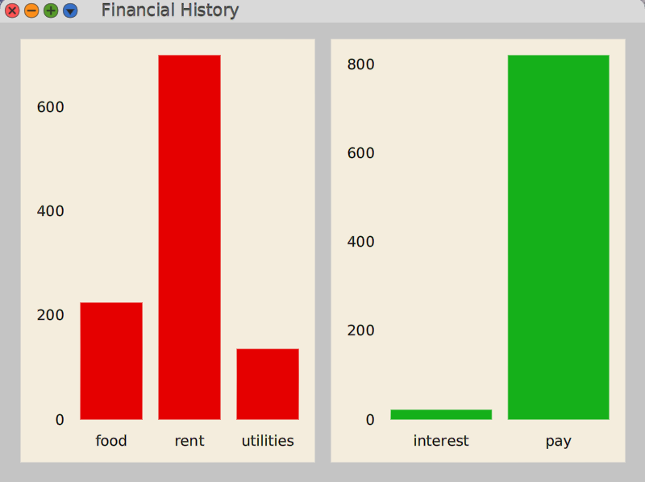

# Cuis-Smalltalk-FinancialTools

This is a Cuis Smalltalk version of the app
presented in Appendix 1 of the book
"Smalltalk-80 The Interactive Programming Environment" by Adele Goldberg.
It implements some features not present in that version
including the ability to:

- hover over a bar and see its value
- resize the window and have the bar charts automatically adjust

